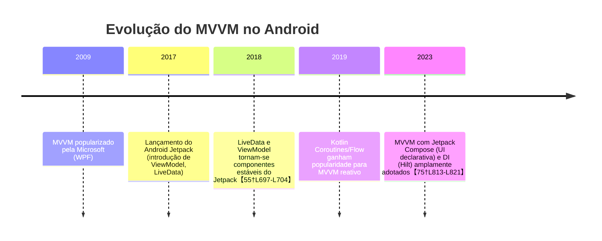

# Resumo Executivo

A arquitetura MVVM (Model-View-ViewModel) é a abordagem recomendada pelo Google para separar responsabilidades e gerenciar o estado da UI usando componentes do Android Jetpack【75†L813-L821】【55†L697-L704】. Em MVVM, o *ViewModel* atua como *state holder*, permitindo persistir o estado da interface do usuário e encapsular a lógica de negócio【55†L697-L704】. Componentes reativos como *LiveData* ou *Flow* propagam mudanças dos modelos de dados para a UI de forma *lifecycle-aware*, evitando problemas em mudanças de configuração【20†L179-L187】【75†L813-L821】. Nossa análise seleciona vídeos técnicos em português (primeiro) e inglês de fontes oficiais ou renomadas, cobrindo níveis iniciante a avançado e focos como ViewModel, LiveData, DataBinding, Coroutines/Flow, Hilt/Dagger, testes, etc. A tabela abaixo compara esses vídeos, seguida de uma descrição individual, sugestões de sequência de estudo e recursos complementares. 

## Visão Geral do MVVM e Evolução

No padrão MVVM, a **camada de apresentação (View)** consome estados expostos por um *ViewModel* que se comunica com repositórios de dados (por exemplo, Room, Retrofit, etc.)【75†L828-L834】【55†L697-L704】. O *ViewModel* permanece vivo durante mudanças de configuração, persistindo estados da UI e atuando como único ponto de acesso à lógica de negócio【55†L697-L704】【75†L828-L834】. O Google recomenda arquiteturas modernas baseadas em fluxos de dados unidirecionais, *state holders* (como ViewModel), Kotlin Coroutines/Flow e injeção de dependência com Hilt/Dagger para escalar o código【75†L813-L821】【90†L918-L921】. 



```mermaid
graph LR
    View[Activity/Fragment/Compose UI] --> ViewModel[ViewModel (mantém estado da UI)]
    ViewModel --> Repository[Repositório (camada de dados)]
    Repository --> DataSource[Origem de dados (Room, Retrofit, etc.)]
```  

A figura acima ilustra um fluxo simplificado de MVVM: a *View* observa mudanças no *ViewModel*, que, por sua vez, delega acesso a dados ao repositório. Essa separação facilita testes e manutenção【75†L828-L834】【90†L918-L921】.

## Tabela Comparativa de Vídeos Recomendados

| Vídeo (Canal)                                      | Idioma    | Duração     | Data              | Nível        | Foco                                    | Conteúdo (pontos-chave)                                                                                                                                           | Pontos Fortes                                           | Limitações                                  | Por que recomendado                        |
|:--------------------------------------------------|:----------|:-----------|:------------------|:-------------|:----------------------------------------|:-----------------------------------------------------------------------------------------------------------------------------------------------------------------|:-------------------------------------------------------|:--------------------------------------------|:-------------------------------------------|
| [**LIVE #008 - MVVM no Android com Kotlin**](https://www.youtube.com/watch?v=Gf5VEBQQzrk) *(Aulas de Android / Kaique Ocanha)* | Português | 1h08min    | ~2019 (aprox.)    | Iniciante    | ViewModel, LiveData, Room, DataBinding   | Aula completa demonstrando MVVM básico em Kotlin: configuração inicial do projeto, uso de ViewModel e LiveData para persistir estado, integração com Room, DataBinding para UI. | Aborda fundamentos passo a passo; em português; inclui exemplos de código claros. | A qualidade do áudio/stream pode variar; data um pouco antiga. | Ideal para iniciantes entenderem MVVM em português. |
| [**Arquitetura Testável com MVVM**](https://www.youtube.com/watch?v=y03XhYyrHhQ) *(Douglas Motta)* | Português | 34min      | 2022              | Intermediário| MVVM, Testes, Hilt/DI, LiveData         | Refatoração de código legadando para MVVM, enfatiza práticas de testes. Mostra uso de ViewModel e LiveData com injeção de dependência (provavelmente Hilt), separando lógica de UI para facilitar testes automatizados.    | Demonstra código real e práticas de testes; enfoque em boas práticas profissionais. | Vídeo relativamente curto, não aprofunda todos os conceitos básicos de MVVM. | Bom para entender testabilidade e DI em MVVM. |
| [**MVVM To-Do List App com Flow (#1)**](https://www.youtube.com/watch?v=Udk6iaR-RXA) *(Coding in Flow)* | Inglês    | 31min      | 2019              | Iniciante    | ViewModel, Room, RecyclerView, DataBinding, Coroutines | Introdução ao projeto de lista de tarefas em MVVM: configuração do layout, criação de camada de dados (Room) e repositório, definição de ViewModel com LiveData. Ensina configuração do ambiente e estrutura básica de MVVM. | Excelente para iniciantes; código limpo e organizado; canal reconhecido com código disponível em GitHub【75†L813-L821】. | Focado na parte inicial; vídeos subsequentes necessários para completar o app. | Recomendado pela clareza e pelo suporte ao aprendizado passo a passo. |
| [**MVVM To-Do List App com Flow (#7)**](https://www.youtube.com/watch?v=dd_Lv7AxqkY) *(Coding in Flow)* | Inglês    | 14min      | 2019              | Intermediário| Kotlin Flow, Coroutines, LiveData       | Demonstra uso de *Flows* e *Coroutines* para combinar fluxos de dados em MVVM. Concentra-se em lógica reativa: combina múltiplos `Flow` do repositório, mapeia para objetos de UI e observa com LiveData. | Aborda técnicas modernas (StateFlow); mostra aplicação prática de Flow em MVVM. | Presume conhecimento dos vídeos anteriores; curto para iniciantes. | Útil para quem já conhece MVVM e quer entender *Flow* e programação reativa. |
| [**Clean Arch Note App com Compose**](https://www.youtube.com/watch?v=8YPXv7xKh2w) *(Philipp Lackner)* | Inglês    | 2h16min    | 2020              | Intermediário| Jetpack Compose, MVVM, Hilt, Room       | Constrói um app de notas do zero usando Clean Architecture com MVVM e Compose: inclui setup do Hilt, criação de classes de casos de uso (use cases), ViewModel para UI, e tela de anotações em Compose. | Exemplifica arquitetura limpa; código disponível; introduz Hilt e Compose juntos; canal com instruções detalhadas. | Longo (aula completa); exige conhecimento prévio de Kotlin e Compose. | Recomendado por cobrir MVVM com Compose e DI em escala real. |
| [**Pokédex App com Jetpack Compose**](https://www.youtube.com/watch?v=v0of23TxIKc) *(Philipp Lackner)* | Inglês    | 21min      | 2020              | Intermediário| Jetpack Compose, MVVM, Retrofit         | Demonstra o início de um app de Pokédex em Compose usando MVVM: configuração do Retrofit para API, criação de ViewModel que busca dados de um serviço REST, e exibição inicial em Compose. | Curto e prático; foca em integração de Retrofit + MVVM + Compose; bom para ver Code. | Apenas primeira parte (incompleto); assume familiaridade com Kotlin/Compose. | Útil para ver MVVM aplicado a chamadas de API em Compose. |
| [**Crash Course MVVM no Android**](https://youtu.be/d7UxPYxgBoA) *(Reso Coder)* | Inglês    | 25min      | 2018              | Intermediário| ViewModel, LiveData, DI, Repository     | Aula prática (tutorial do canal Reso Coder) criando um app simples de *quotes*. Ensina MVVM com LiveData e um repositório simulado, usando Injeção de Dependência (simples). Código disponível no blog.    | Conteúdo didático e focado; blog complementar com código【73†L34-L41】; ideal para entrevistas técnicas. | Usa versões mais antigas dos libs; versão em inglês. | Bom para reforçar fundamentos de MVVM e lógica de repositório. |
| [**Fun with LiveData**](https://youtu.be/Avflz21kvUY) *(Android Dev Summit)* | Inglês    | 10min      | 2018              | Avançado     | LiveData, Lifecycle, AndroidX          | Palestra técnica do Android Developers Summit mostrando casos avançados de uso de LiveData e Lifecycle. Explora como o LiveData lida com rotinas assíncronas e cenários específicos de ciclo de vida do Android.    | Conteúdo oficial e profundo; explica internals do LiveData; alto nível técnico. | Focado apenas em LiveData (não apresenta código completo de app). | Recomendado para entender melhor os detalhes de LiveData em MVVM. |

## Análise Individual dos Vídeos

- **LIVE #008 – MVVM no Android com Kotlin (Kaique Ocanha)** – **Idioma:** PT‑BR. **Duração:** ~1h08min. **Data:** ~2020. **Nível:** Iniciante. **Foco:** ViewModel, LiveData, Room, DataBinding. *Conteúdo:* demonstra desde o setup do projeto até a implementação de ViewModel que mantém o estado da UI (persistido durante rotações) e LiveData observável ligado à camada de dados (Room). Inclui DataBinding para vincular a UI. *Pontos Fortes:* passo a passo claro, em português, ótima introdução para quem nunca usou MVVM. *Limitações:* exemplo básico, não aborda tópicos avançados como Coroutines ou Hilt; vídeo é streaming (qualidade variável). *Por que:* ideal para começar por ser detalhado e didático em português, cobrindo os pilares do MVVM【55†L697-L704】【75†L828-L834】.

- **Arquitetura Testável com MVVM (Douglas Motta)** – **Idioma:** PT‑BR. **Duração:** ~34min. **Data:** 2022. **Nível:** Intermediário. **Foco:** MVVM, Testes de Unidade, Hilt/DI, LiveData. *Conteúdo:* mostra refatoração de código legada para padrão MVVM testável. Cria ViewModel e repositório, usa injeção de dependências (provavelmente Hilt) e LiveData. Demonstra como isolar lógica para permitir testes automatizados (JUnit, Mockito). *Pontos Fortes:* foca em práticas de engenharia de software (testes, DI) além dos conceitos MVVM; código real refatorado. *Limitações:* supõe conhecimentos prévios; não trata desde o básico do MVVM, é breve para muitos conceitos. *Por que:* excelente para entender como aplicar MVVM em um projeto real e escrever testes, assunto pouco coberto em tutoriais comuns【90†L918-L921】.

- **MVVM To-Do List App com Flow (#1 – Coding in Flow)** – **Idioma:** Inglês. **Duração:** 30min. **Data:** 2019. **Nível:** Iniciante. **Foco:** ViewModel, Room, LiveData, DataBinding. *Conteúdo:* primeiro episódio de uma série: configura o projeto, cria camada de dados com Room e repositório, desenvolve ViewModel expondo LiveData de lista de tarefas, e vincula em uma RecyclerView usando DataBinding. Segue arquitetura recomendada (camadas separadas). *Pontos Fortes:* canal renomado, código no GitHub, explicações claras. *Limitações:* série extensa (são várias partes); sozinho não monta app completo. *Por que:* cobre os fundamentos de MVVM bem organizados, bom para consolidar conceitos básicos de Architecture Components【55†L697-L704】.

- **MVVM To-Do List App com Flow (#7 – Coding in Flow)** – **Idioma:** Inglês. **Duração:** 14min. **Data:** 2019. **Nível:** Intermediário. **Foco:** Kotlin Flow, Coroutines, LiveData. *Conteúdo:* aborda abordagem reativa: combinações de múltiplos *Flow* vindos do repositório de dados, convertendo-os em um único fluxo observado pela UI. Mostra uso de `StateFlow` e operadores do Kotlin Flow. *Pontos Fortes:* atual (usa Flow, StateFlow), demonstra programação reativa no MVVM. *Limitações:* exige conhecimento dos vídeos anteriores; foca só em Coroutines/Flow (deixa de lado UI/Binding). *Por que:* bom complemento para quem já conhece MVVM básico e quer adotar Flow/Coroutines para dados assíncronos【75†L813-L821】.

- **Clean Arch Note App (Philipp Lackner)** – **Idioma:** Inglês. **Duração:** 2h16min (parte única). **Data:** 2020. **Nível:** Intermediário. **Foco:** Jetpack Compose, MVVM, Hilt, Room. *Conteúdo:* tutorial completo criando app de notas com Clean Architecture. Configura Hilt para DI, define camadas (use cases/domínio), implementa ViewModel para gerenciar UI state e usa Compose para as telas (listagem e edição de notas). *Pontos Fortes:* combina MVVM com práticas modernas (Compose + Hilt); código profissional disponível; aborda padrões de arquitetura limpa. *Limitações:* curso longo; pressupõe experiência em Kotlin/Compose; às vezes muito denso para iniciantes. *Por que:* excelente para aprender MVVM integrado com Compose e DI, mostrando uso real de ViewModel e Flow em uma app atual【75†L813-L821】【90†L918-L921】.

- **Pokédex App com Jetpack Compose (Philipp Lackner)** – **Idioma:** Inglês. **Duração:** 22min. **Data:** 2020. **Nível:** Intermediário. **Foco:** Jetpack Compose, MVVM, Retrofit. *Conteúdo:* início de um app de Pokédex: configura Retrofit para consumir API do Pokémon, cria ViewModel que busca dados e os expõe via LiveData/StateFlow, e desenvolve UI em Compose para mostrar resultados iniciais. *Pontos Fortes:* exemplo conciso de MVVM com rede; mostra rápido integração de API. *Limitações:* somente a parte inicial; não cobre persistência local; assume conhecimentos prévios. *Por que:* útil para ver MVVM aplicado a chamadas REST e UI Compose de forma rápida.  

- **Crash Course MVVM (Reso Coder)** – **Idioma:** Inglês. **Duração:** 25min. **Data:** 2018. **Nível:** Intermediário. **Foco:** ViewModel, LiveData, Repositório. *Conteúdo:* tutorial criando app de “quotes” básicos. Ensina o padrão MVVM do zero: ViewModel recebe ações da UI, mantém `LiveData` de lista de quotes, e utiliza um repositório simples (aula foca no core MVVM). Há injeção de dependência manual. *Pontos Fortes:* didático e focado; acompanha post no blog com código completo【73†L34-L41】. *Limitações:* usa versões antigas da biblioteca; falta abordagem com Coroutines. *Por que:* reforça conceitos centrais do MVVM e é fonte confiável (Reso Coder) para um entendimento rápido da arquitetura.

- **Fun with LiveData (Android Dev Summit)** – **Idioma:** Inglês. **Duração:** 10min. **Data:** 2018. **Nível:** Avançado. **Foco:** LiveData, Lifecycle (AndroidX). *Conteúdo:* palestra técnica oficial do Android Developers Summit (2018). Explora internamente como o LiveData funciona com o ciclo de vida de Activities/Fragments, cenários avançados de atualização de UI e integração com coroutines. *Pontos Fortes:* conteúdo oficial e profundo; explica detalhes do componente LiveData. *Limitações:* não é tutorial prático de código completo; apenas aborda LiveData em isolamento. *Por que:* recomenda-se para quem quer compreender melhor o LiveData no contexto do MVVM e AndroidX.

## Sequência de Estudo

1. **Fundamentos MVVM (PT)** – Comece com o vídeo do Kaique Ocanha (MVVM Básico) para internalizar conceitos de ViewModel/LiveData em português.   
2. **MVVM Crash Course (EN)** – Assista ao tutorial do Reso Coder para reforçar os conceitos de MVVM com código disponível【73†L34-L41】.  
3. **Exemplo Prático MVVM (PT/EN)** – Siga com o vídeo do Douglas Motta para ver MVVM aplicado em código real e teste unidades, e/ou o primeiro vídeo do Coding in Flow (#1) para um passo a passo em inglês.  
4. **MVVM com Kotlin Flow (EN)** – Veja o episódio #7 do Coding in Flow focado em *Flow* para adotar programação reativa em MVVM.  
5. **MVVM com Compose e DI (EN)** – Estude a playlist do Philipp Lackner sobre Compose: assista primeiro ao tutorial do app Pokédex (parte 1) e depois ao tutorial de Clean Architecture, para combinar MVVM com Compose e Hilt【90†L918-L921】.  
6. **Aprofundamento LiveData (EN)** – Finalmente, veja a palestra “Fun with LiveData” (Android Dev Summit) para entender detalhes avançados de LiveData no ciclo de vida.  

## Recursos Complementares

- **Documentação Oficial Android:** Guia de arquitetura do Google (MVVM/AC): *“App architecture”*【75†L813-L821】【55†L697-L704】 e páginas sobre *ViewModel* e *LiveData* no Android Developers. Esses documentos explicam o padrão MVVM e recomendam práticas como state holders, Flows e DI【75†L813-L821】【55†L697-L704】.  
- **Tutoriais Específicos:** Artigo *“Android MVVM LiveData Data Binding”* (DigitalOcean) mostra um exemplo de MVVM com DataBinding e LiveData【20†L179-L187】. Blogs técnicos como Reso Coder explicam MVVM com exemplos de código (vide [73]).  
- **Códigos de Exemplo:** Repositórios GitHub com código MVVM: o *MVVM To-Do App* do Coding in Flow (em Kotlin com Flows) e o projeto *mvvm-android-architecture-crash-course* do Reso Coder contêm implementações completas de MVVM. (Por exemplo, repositório [ResoCoder/mvvm-android-architecture-crash-course] e [codinginflow/MVVMTodo]).  
- **Outros Vídeos e Cursos:** Plataformas como a documentação do **Android Developers** e YouTube oficial têm seções e vídeos sobre ViewModel, LiveData, DataBinding e Hilt. Além disso, considere o livro *“Android Nativo com Kotlin e MVVM”* (Casa do Código) como referência complementar. 

Cada recurso acima fornece código ou explicações detalhadas, de modo a aprofundar o aprendizado do padrão MVVM em Android, alinhado às recomendações oficiais【75†L813-L821】【55†L697-L704】.
